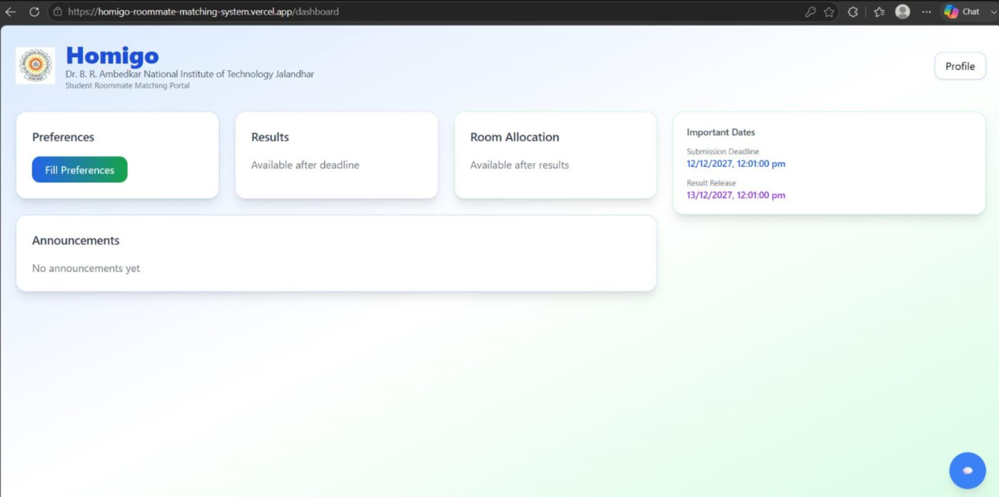
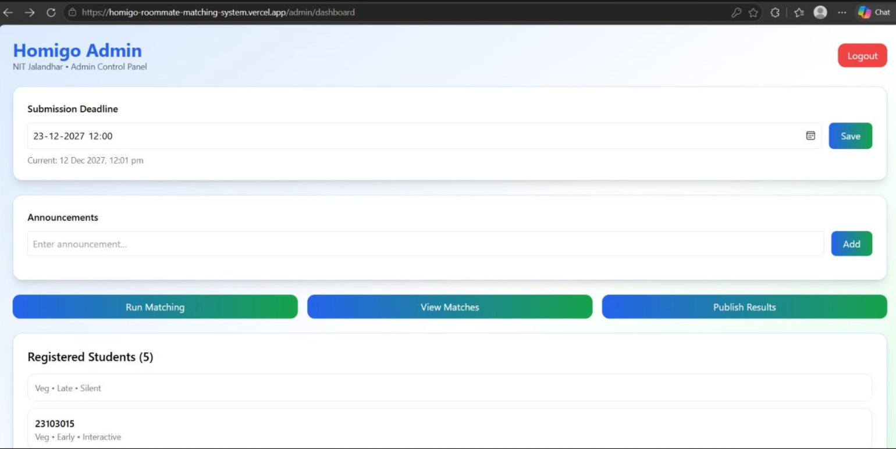

# Homigo – AI Powered Roommate Matching System

Homigo is a full-stack web application that helps hostels automatically match compatible roommates based on student preferences while also supporting students who already have a preferred roommate.

## Live Demo

🌐 https://homigo-roommate-matching-system.vercel.app

## GitHub Repository

https://github.com/HitaliFulekar/Homigo-Roommate-Matching-System

---

## Features

### Student
- Student Login
- Fill roommate preferences
- Choose known roommate
- View assigned roommate
- View announcements

### Admin
- Admin Login
- Manage announcements
- Set submission deadline
- View registered students
- Run AI-based roommate matching

### Matching System
- Preference-based compatibility scoring
- Known-peer override matching
- Prevent duplicate roommate allocation
- Display unmatched students

---

## Tech Stack

### Frontend
- React.js
- Vite
- Tailwind CSS

### Backend
- Node.js
- Express.js

### Database
- MongoDB Atlas
- Mongoose

### Deployment
- Frontend: Vercel
- Backend: Render

---

## Screenshots


---

## Project Structure

```
frontend/
backend/
```

---

## Installation

Clone the repository

```bash
git clone https://github.com/HitaliFulekar/Homigo-Roommate-Matching-System.git
```

Backend

```bash
cd backend
npm install
npm start
```

Frontend

```bash
cd frontend
npm install
npm run dev
```

---

## Future Enhancements

- Email notifications
- AI explanation for roommate matching
- Profile editing
- Hostel room allocation visualization
- Mobile responsive improvements

---

## Author

**Hitali Fulekar**

B.Tech Computer Science Engineering  
NIT Jalandhar